# Lambda Function Invoke On CloudWatch Events Through AWS Console

## Description
Walkthrough on Lambda Function invoke on scheduling with CloudWatch Events configuration through AWS console
 
## Overview
In this exercise, we will learn, how to create and invoke simple python `Lambda Function` with `CloudWatch Events` in regular intervals.
Here are the steps.

### Step - 1
----
First, we assume that you have already set the AWS account which you have logged in and created the `Role` for Lambda in `IAM`. Now let’s go to the AWS Lambda console, select `Functions` from left side and click on the `Create function` button.

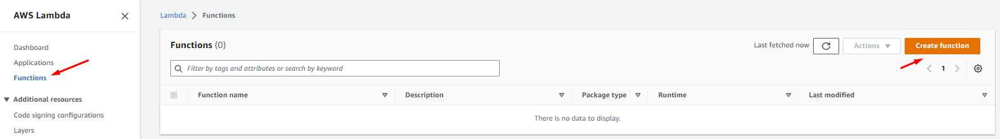

Give `Function name`, select `Runtime`, select the `Execution role` you created first and click on the `Create function` button.

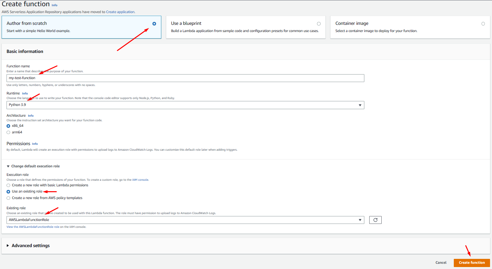

After that your function looks like this

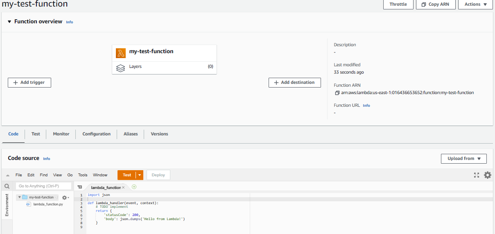

### Step - 2
----
Now go to `CloudWatch` console, from left side expand `Events`, click on the `Rules` and click on `Create rule` button.

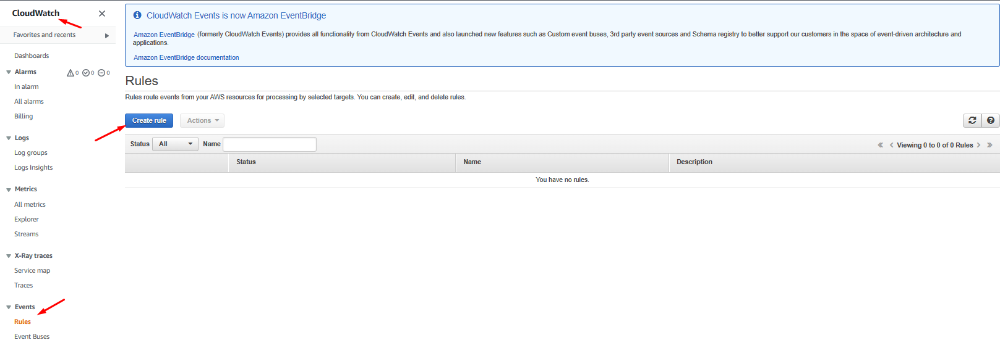

Select `Event Source` as you required and in `Targets` select your lambda function and click on `Configure details` button.

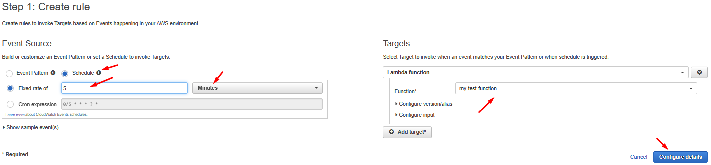

Give `Name` and `Description`, click on `Create rule` button

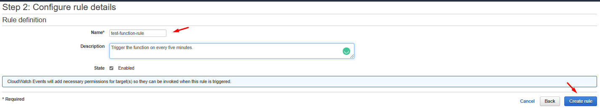

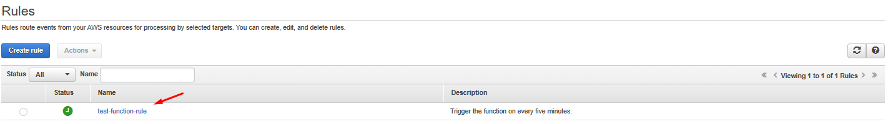

### Step - 3
----
Refresh the lambda function console so there you can see cloudwatch events added.

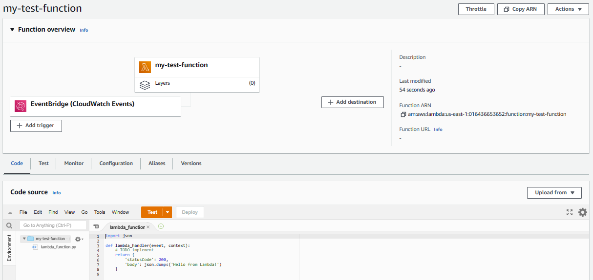

Now as you configured the cloudwatch event, it runs the function for first time after that it’s run every five minutes as scheduled. To check that go to `CloudWatch` console in `Log groups`.

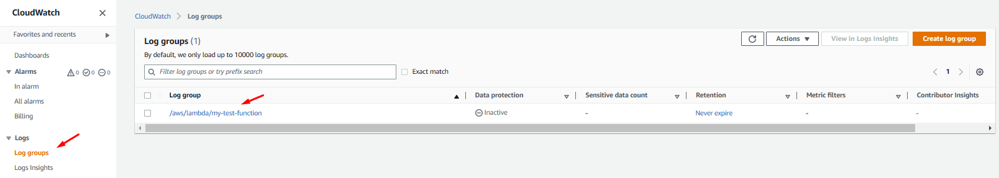

Click on the logs to explore

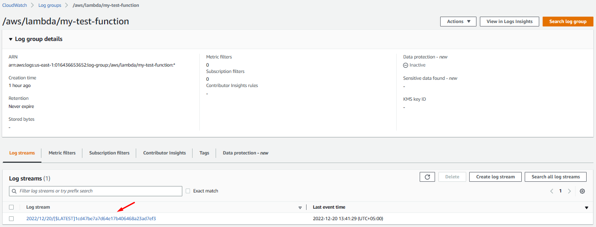

Further click on the log stream to view the detail logs.

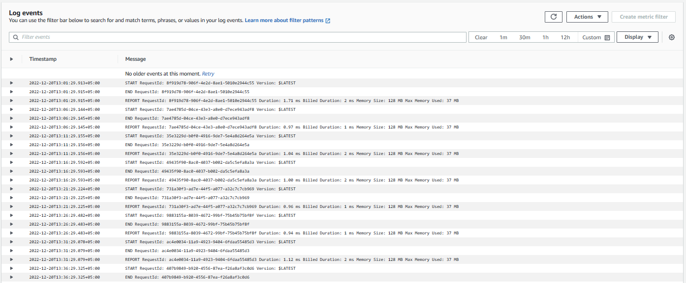

As you can see every five minutes our function is invoked with a CloudWatch event.

### Step - 4
----
Finally, we clean-up the resources so that we don’t incur any cost for that:
- Delete `Rule` from `Events` in the AWS CloudWatch console.
- Delete `Logs` from `Log groups` in the AWS CloudWatch console.
- Delete the `Function` from the AWS Lambda Function Console.
